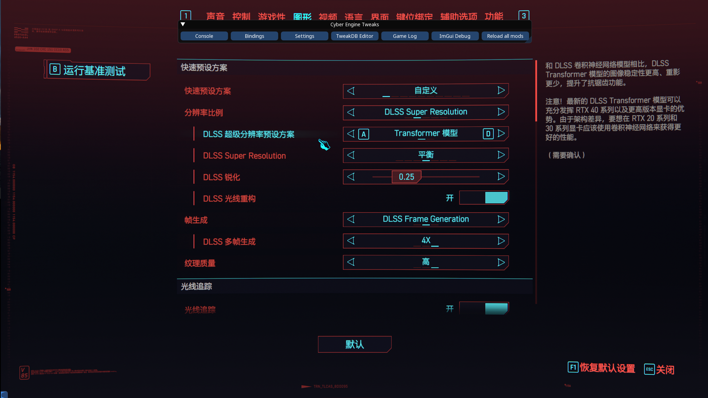

# 《赛博朋克 2077》CET-DLSSG 代理桥接

为《赛博朋克 2077》的 Cyber Engine Tweaks（CET）与 DLSSG Native 生成兼容的 `version.dll` 代理桥接文件，同时保留 RED4ext 使用的 `winmm.dll`。

本项目不是 CET 或 DLSSG 的源码合并，也不会编译 C/C++。它只修改 CET 已编译代理 DLL 的 PE 导出表，并将 DLSSG 请求转发到旁路 DLL。



## 实测结果

以下组合已经在游戏中同时运行：

- 显卡：RTX 3070 Ti
- 驱动：591.86
- 游戏：《赛博朋克 2077》2.31
- CET：1.37.1
- RED4ext：1.30.0
- DLSSG Native：0.2.4
- 未开启帧生成：约 50 FPS
- 开启 DLSS 多帧生成 4X：约 203 FPS

该结果只说明上述组合实测可用，不保证所有硬件、游戏版本或后续 Mod 版本具有相同表现。

## 工作原理

```text
Cyberpunk2077.exe
├─ version.dll              CET / Ultimate ASI Loader 外层代理
│  ├─ 加载 CET
│  └─ 将 NVSDK_NGX_* 转发到 versionHooked.dll
├─ versionHooked.dll        未修改的 DLSSG 代理
└─ winmm.dll                RED4ext 原始代理，与本项目相互独立
```

生成脚本使用 Python 的 `LIEF` 读取 CET 原始 `version.dll`，扫描 DLSSG DLL 的全部 `NVSDK_NGX_*` 导出，然后将同名转发项加入外层 DLL。DLSSG 原始 DLL 不作修改，只复制并改名为 `versionHooked.dll`。

因此不需要安装 Visual Studio、CMake、Windows SDK 或 CUDA Toolkit。

## 环境要求

硬性要求：

- Windows 10 或 Windows 11，64 位
- Python 3.12，64 位，并带有 `py` 启动器
- Windows PowerShell 5.1 或 PowerShell 7

本次生成验证使用：

- Python 3.12.0
- PowerShell 7.6.5
- LIEF 1.0.0
- pefile 2024.8.26

Python 依赖已经锁定在 [requirements.txt](requirements.txt)。

## 获取输入文件

出于第三方二进制再分发与安全考虑，本仓库不提交输入 DLL 或生成后的 DLL。请从可信上游自行下载：

- [Cyber Engine Tweaks](https://github.com/maximegmd/CyberEngineTweaks)
- [DLSSG Native / dlssg_for_sm86](https://github.com/sdli1995/dlssg_for_sm86)
- [RED4ext](https://github.com/WopsS/RED4ext)
- [Ultimate ASI Loader](https://github.com/ThirteenAG/Ultimate-ASI-Loader)

把文件放入 `input`：

| 来源 | 原文件 | 本项目中的文件名 |
|---|---|---|
| CET 安装包 | `bin\x64\version.dll` | `input\cet-ual-version.dll` |
| DLSSG Native | `version.dll` | `input\dlssg-sm86-version.dll` |
| DLSSG Native | `dlssg_sm86.ini` | `input\dlssg_sm86.ini` |

RED4ext 不参与 DLL 生成。它的 `winmm.dll` 和 `red4ext` 目录按 RED4ext 官方方式安装即可。

> [!WARNING]
> 烟雾测试会在本机进程中实际加载并执行输入 DLL。只使用可信来源下载的文件，并在运行前用安全软件和 SHA256 校验来源。自签名或未签名 DLL 不等于恶意文件，但也不能单凭签名判断其安全性。

## 生成 DLL

在仓库目录中安装 Python 依赖：

```powershell
py -3.12 -m pip install -r .\requirements.txt
```

生成并自动执行烟雾测试：

```powershell
.\build.ps1
```

脚本会：

1. 检查 CET 外层 DLL 和 DLSSG 内层 DLL 的必要导出。
2. 扫描 DLSSG 中所有 `NVSDK_NGX_*` 导出。
3. 将转发项加入 CET 外层 DLL。
4. 将 DLSSG 原始 DLL 复制为 `versionHooked.dll`。
5. 在临时目录验证 DLL 加载、全部 NGX 导出和加载拦截。
6. 测试通过后将三个文件写入 `dist`。

当前版本测试成功时会看到：

```text
all_ngx_exports_resolved=50/50
redirect_matches_inner=True
NVSDK_NGX_GetAPIVersion()=19
```

以后 DLSSG 的导出数量可能变化，不要求永远是 50；关键是斜杠两侧数量相等，并且重定向结果为 `True`。

## 安装

完全退出游戏，将 `dist` 中以下文件复制到游戏的 `bin\x64` 目录：

- `version.dll`
- `versionHooked.dll`
- `dlssg_sm86.ini`

同时保留：

- RED4ext 的 `winmm.dll` 和 `red4ext` 目录
- CET 的 `plugins` 目录和正式 `global.ini`
- 游戏自带的 `nvngx_dlssg.dll`

不要把测试用的 `tools\merge-test-global.ini` 复制到游戏目录，它会关闭 CET 插件加载。

## 更新 CET 或 DLSSG

CET 更新后，用新版 CET 的 `version.dll` 替换 `input\cet-ual-version.dll`。

DLSSG 更新后，用新版 DLL 和 INI 替换：

- `input\dlssg-sm86-version.dll`
- `input\dlssg_sm86.ini`

再次运行 `build.ps1`。只有烟雾测试通过，并且进入游戏确认 CET、RED4ext 和帧生成均正常后，才能认为新组合兼容。

以下变化可能需要重新分析：

- CET 不再使用当前 Ultimate ASI Loader 或不再导出 `ResolveAddress`
- 加载器不再自动加载 `versionHooked.dll`
- DLSSG 要求固定代理文件名或改变拦截机制
- 两个项目新增互相冲突的 Hook

## 卸载与回滚

完全退出游戏后，删除本项目加入的 `versionHooked.dll` 和 `dlssg_sm86.ini`，再用 CET 安装包中的原始 `version.dll` 覆盖合并版。不要删除 RED4ext 的 `winmm.dll`。

安装或更新前建议备份游戏目录中原有的 `version.dll`、`winmm.dll`、`global.ini` 和 `nvngx_dlssg.dll`。

## 当前测试文件的 SHA256

以下校验值仅对应上述实测版本：

```text
67565DD7F899C0E4EE3903B1CC8078FF20CA80B8100497C6AC813392E431D443  input/cet-ual-version.dll
C844646D835A7B88ED1382EEA80403D38B433F8AC09CF92581C73698C44AE7C2  input/dlssg-sm86-version.dll
FD7F0722194E6E8D8C085327D9826EFFB411925A69A5E7549D70EFF26A9F18B5  input/dlssg_sm86.ini
A3A95C8C230F03B4E6DB8359D2F73A1F835B3F71D776E20534BA203DD21C7178  dist/version.dll
C844646D835A7B88ED1382EEA80403D38B433F8AC09CF92581C73698C44AE7C2  dist/versionHooked.dll
FD7F0722194E6E8D8C085327D9826EFFB411925A69A5E7549D70EFF26A9F18B5  dist/dlssg_sm86.ini
```

## 许可与免责声明

本仓库原创脚本使用 MIT 许可证。该许可证不覆盖 CET、Ultimate ASI Loader、RED4ext、DLSSG、NVIDIA 资产或游戏文件。第三方项目仍受各自许可证和使用条款约束，详见 [THIRD_PARTY.md](THIRD_PARTY.md)。

本项目与 CD PROJEKT RED、NVIDIA 及上述 Mod 作者没有从属或官方合作关系。使用前请自行备份文件并承担 Mod 兼容性风险。
